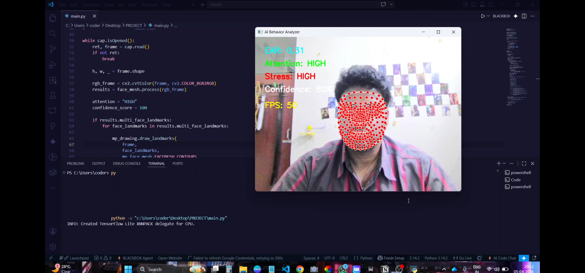

# 💀 AI Behavior Analyzer

## 📸 Demo



<p align="center">
  
  
  
  
</p>

---

## 🚀 Overview

**AI Behavior Analyzer** is a real-time computer vision system that analyzes human behavior using facial landmarks and eye tracking.

It goes beyond simple face detection and attempts to **interpret human behavior signals** like:

* 👁️ Eye blinking
* 👀 Attention level
* 😬 Stress indication
* 🧠 Confidence estimation

---

## 🎯 Features

✔️ Real-time face detection
✔️ Eye Aspect Ratio (EAR) based blink detection
✔️ Attention tracking using head movement
✔️ Stress estimation via blink patterns
✔️ Confidence scoring system
✔️ Live FPS monitoring

---

## 🧠 How It Works

```text
Webcam → OpenCV → MediaPipe Face Mesh → Landmark Extraction → Behavior Logic → Output
```

* Uses **468 facial landmarks**
* Computes **Eye Aspect Ratio (EAR)** for blink detection
* Tracks **nose position** for attention analysis
* Combines signals into a **behavior scoring system**

---

## 🛠 Tech Stack

| Technology | Purpose                   |
| ---------- | ------------------------- |
| Python     | Core programming          |
| OpenCV     | Video processing          |
| MediaPipe  | Facial landmark detection |
| NumPy      | Mathematical operations   |

---

## ▶️ Installation & Usage

### 1. Clone the repository

```bash
git clone https://github.com/CoderXash9/AI-Behavior-Analyzer.git
cd AI-Behavior-Analyzer
```

### 2. Install dependencies

```bash
pip install -r requirements.txt
```

### 3. Run the project

```bash
python main.py
```


## 💡 Use Cases

* 🎓 Online exam proctoring
* 🚗 Driver drowsiness detection
* 🧠 Productivity & focus tracking
* 🕵️ Behavioral analysis systems

---

## ⚠️ Limitations

* Not 100% accurate (rule-based logic)
* Sensitive to lighting conditions
* Requires front-facing camera

---

## 🚀 Future Improvements

* Add ML-based emotion detection
* Build dashboard (Streamlit)
* Improve accuracy using deep learning
* Store behavioral data over time

---

## 🙌 Author

**Ashwini**
B.Tech CSE . XENO

---

## ⭐ Support

If you found this project interesting, consider giving it a ⭐ on GitHub!
